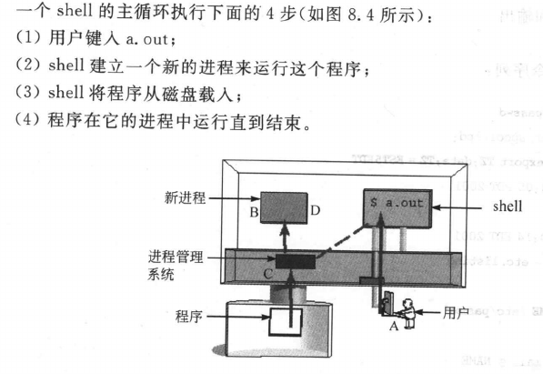

头文件

unistd.h：sleep、getpid

stdlib.h：exit

<sys/wait.h>：wait

## shell 是如何运行程序的

### 1、shell 的功能

- 运行程序
- 管理输入输出
- 可编程

2、

shell 由下面主循环构成

fork execvp 详见这篇 Blog

如何创立进程：fork

如何运行一个程序：execpv

还需要知道如何让父进程等待子进程

系统调用 wait 做两件事

- wait 暂停调用它的进程直至子进程结束
- wait 取得子进程结束时传给 exit 的值

