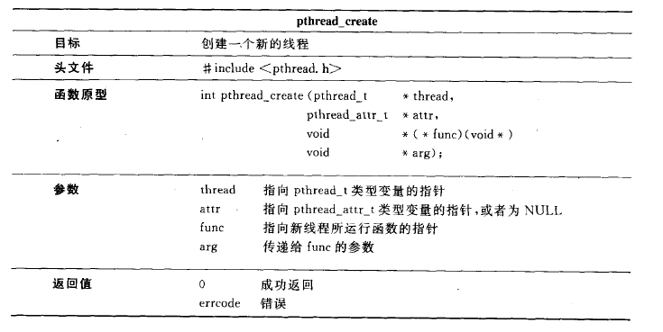
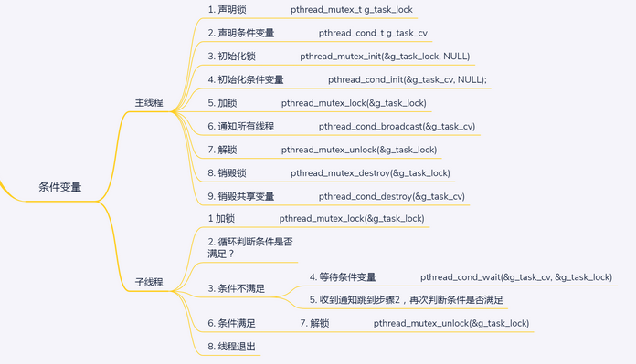

[POSIX介绍](https://blog.csdn.net/weixin_40039738/article/details/81867577)

线程接口也称为“pthread”或“POSIX 线程"

使用 pthread 需要包含一个头文件：pthread.h

 同时连一个共享库：libpthread.so  即 gcc 编译时加选项 -lpthread**

```shell
gcc twoCount3.c -lpthread -o twc
```


## 线程的创建：如何执行一个新子项目？


pthread_create 不是一个系统调用，是 Glibc 库的一个函数



对于每一个文件和每一个线程，可以调用 pthread_create 创建线程。一共有四个参数，第一个参数是线程对象，第二个参数是线程的属性，第三个参数是线程运行函数，第四个参数是线程运行函数的参数。主线程就是通过第四个参数，将自己的任务派给子线程。


当一个线程退出的时候，就会发送信号给其他所有同进程的线程。有一个线程使用 pthread_join 获取这个线程退出的返回值。线程的返回值通过 pthread_join 传给主线程，这样子线程就将自己返回值信息告诉给主线程。


现在完成一个并行记录文件中单词个数多线程应用

对于线程需要多个参数， 可以采用结构体来传送

```c
struct arg_set{
    char *fname;
    int cnt;
};
```

进行线程的创建

```c
    args1.fname = argv[1];
    args1.cnt = 0;
    pthread_create(&t1, NULL, countWords, (void*)&args1);
    
    args2.fname = argv[2];
    args2.cnt = 0;
    pthread_create(&t2, NULL, countWords, (void*)&args2);
```

等待线程完成，并返回参数

```c
    // 进行等待
    pthread_join(t1, NULL);
    pthread_join(t2, NULL);

    printf("%5d: %s\n", args1.cnt, argv[1]);
	printf("%5d: %s\n", args2.cnt, argv[2]);
	printf("%5d: total words\n", args1.cnt + args2.cnt);
```

output

```shell
husharp@hjh-Ubuntu:~/CS/Unix-Linux/Unix&Linux_Programming/ch14$ ./twc ./README.md ./twoCount3.c 
    3: ./README.md
  168: ./twoCount3.c
  171: total words
```


## 线程的数据

我们把线程访问的数据细分成三类。下面我们一一来看


第一类是**线程栈上的本地数据**，比如函数执行过程中的局部变量。前面我们说过，函数的调用会使用栈的模型，这在线程里面是一样的。只不过每个线程都有自己的栈空间。

主线程在内存中有一个栈空间，其他线程栈也拥有独立的栈空间。为了避免线程之间的栈空间踩踏，线程栈之间还会有小块区域，用来隔离保护各自的栈空间。一旦另一个线程踏入到这个隔离区，就会引发段错误。

栈的大小可以通过命令 ulimit -a 查看，默认情况下线程栈大小为 8192（8MB）。我们可以使用命令 ulimit -s 修改。

对于线程栈，可以通过下面这个函数 pthread_attr_t，修改线程栈的大小。

```c
int pthread_attr_setstacksize(pthread_attr_t *attr, size_t stacksize);
```


第二类数据就是**在整个进程里共享的全局数据**。例如全局变量，虽然在不同进程中是隔离的，但是在一个进程中是共享的。如果同一个全局变量，两个线程一起修改，那肯定会有问题，有可能把数据改的面目全非。这就需要有一种机制来保护他们，比如你先用我再用。这一节的最后，我们专门来谈这个问题。

那线程能不能像进程一样，也有自己的私有数据呢？如果想声明一个线程级别，而非进程级别的全局变量，有没有什么办法呢？虽然咱们都是一个大组，分成小组，也应该有点隐私。


## 数据的保护

接下来，我们来看共享的数据保护问题。

### 1、信号量与互斥

> **区别**
>
> 互斥只能一个：
>
> 一个防止他人进入的简单方法，就是门口加一把锁。先到的人锁上门，后到的人看到上锁，就在门口排队，等锁打开再进去。这就叫["互斥锁"](http://zh.wikipedia.org/wiki/互斥锁)（Mutual exclusion，缩写 Mutex），防止多个线程同时读写某一块内存区域。
>
> 信号量可以多个：
>
> 就是在门口挂n把钥匙。进去的人就取一把钥匙，出来时再把钥匙挂回原处。后到的人发现钥匙架空了，就知道必须在门口排队等着了。这种做法叫做["信号量"](http://en.wikipedia.org/wiki/Semaphore_(programming))（Semaphore），用来保证多个线程不会互相冲突。
>
> mutex是semaphore的一种特殊情况（n=1时）。也就是说，完全可以用后者替代前者。但是，因为mutex较为简单，且效率高，所以在必须保证资源独占的情况下，还是采用这种设计。

我们先来看一种方式，**Mutex**，全称 Mutual Exclusion，中文叫**互斥**。顾名思义，有你没我，有我没你。它的模式就是在共享数据访问的时候，去申请加把锁，谁先拿到锁，谁就拿到了访问权限，其他人就只好在门外等着，等这个人访问结束，把锁打开，其他人再去争夺，还是遵循谁先拿到谁访问。


使用 Mutex，首先要使用 pthread_mutex_init 函数初始化这个 mutex，初始化后，就可以用它来保护共享变量了。

pthread_mutex_lock() 就是去抢那把锁的函数，如果抢到了，就可以执行下一行程序，对共享变量进行访；如果没抢到，就被阻塞在那里等待。

> 如果不想被阻塞，可以使用 pthread_mutex_trylock 去抢那把锁，如果抢到了，就可以执行下一行程序，对共享变量进行访问；如果没抢到，不会被阻塞，而是返回一个错误码。

当共享数据访问结束了，别忘了使用 pthread_mutex_unlock 释放锁，让给其他人使用，最终调用 pthread_mutex_destroy 销毁掉这把锁。


### 2、条件变量

在使用 Mutex 的时候，有个问题是如果使用 pthread_mutex_lock()，那就需要一直在那里等着。如果是  pthread_mutex_trylock()，就可以不用等着，去干点儿别的，但是我怎么知道什么时候回来再试一下，是不是轮到我了呢？能不能在轮到我的时候，通知我一下呢？

这其实就是条件变量，也就是说如果没事儿，就让大家歇着，有事儿了就去通知，别让人家没事儿就来问问，浪费大家的时间。

但是当它接到了通知，来操作共享资源的时候，还是需要抢互斥锁，因为可能很多人都受到了通知，都来访问了，所以**条件变量和互斥锁是配合使用的**。

如果说互斥锁是用于同步线程对于共享数据的访问，那么条件变量便是用于在线程之间同步共享数据的值。


```
pthread_cond_init
pthread_cond_wait
```


