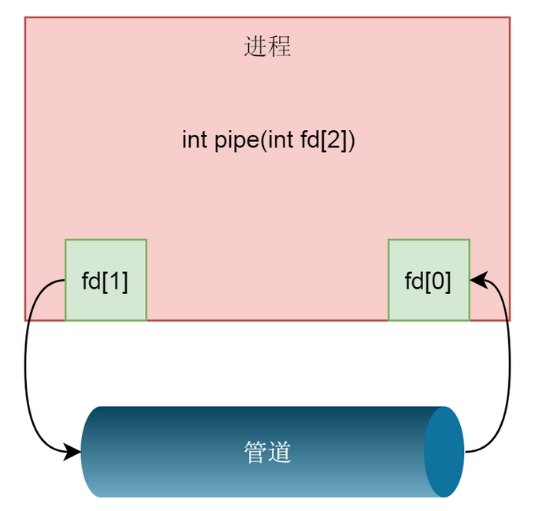
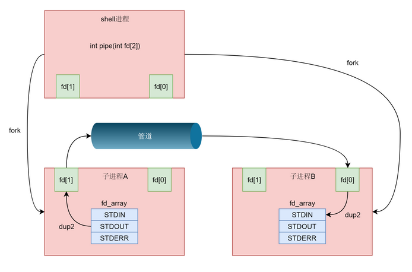

[select、poll、epoll之间的区别总结](https://www.cnblogs.com/Anker/p/3265058.html)


# 进程间通信

## 管道模型


管道分为两种类型：匿名管道、命名管道

“|” 表示的管道称为**匿名管道**，意思就是这个类型的管道没有名字，用完了就销毁了。就像上面那个命令里面的一样，竖线代表的管道随着命令的执行自动创建、自动销毁。用户甚至都不知道自己在用管道这种技术，就已经解决了问题。所以这也是面试题里面经常会问的，到时候千万别说这是竖线，而要回答背后的机制，管道。

另外一种类型是**命名管道**。这个类型的管道需要通过 mkfifo 命令显式地创建。

```shell
mkfifo hello
```

hello 就是这个管道的名称。管道以文件的形式存在，这也符合 Linux 里面一切皆文件的原则。这个时候，我们 ls 一下，可以看到，这个文件的类型是 p，就是 pipe 的意思。

```
prw-r--r-- 1 husharp husharp   0 12月  1 18:07 hello
```

我们可以往管道里面写入东西。例如，写入一个字符串。

```

```


### 匿名管道




利用下面的系统调用来创建管道


array[0] 是读， array[1] 是写

**所谓的匿名管道，其实就是内核里面的一串缓存**。如果对于 fd[1] 写入，调用的是 pipe_write，向 pipe_buffer 里面写入数据；如果对于 fd[0] 的读入，调用的是 pipe_read，也就是从 pipe_buffer 里面读取数据。

演示打开管道

```c
    // get a pipe
    if(pipe(apipe) == -1) {
        perror("could not make pipe");
		exit(1);
    }
    printf("Got a pipe! It is file descriptors: { %d %d }\n", 
							apipe[0], apipe[1]);
```

进行 `ead from stdin, write into pipe, read from pipe, print `

即内部自己通信演示 demo

```c
    /* read from stdin, write into pipe, read from pipe, print */
    while(fgets(buf, BUFSIZ, stdin)) {
        len = strlen(buf);
        if(write(apipe[1], buf, len) != len) {
            perror("writing to pipe");		/* down */
			break;					/* pipe */
        }
        for ( i = 0; i < len; i++)  // wipe
        {
            buf[i] = 'X';
        }
        // printf("%s ", *buf);
        len = read(apipe[0], buf, BUFSIZ);
		if ( len == -1 ){				/* from */
			perror("reading from pipe");		/* pipe */
			break;
		}
		if ( write( 1 , buf, len ) != len ){		/* send  */
			perror("writing to stdout");		/* to    */
			break;					/* stdout */
		}
    }
```

#### 采用 fork 来共享管道

但是这个时候，两个文件描述符都是在一个进程里面的，并没有起到进程间通信的作用，怎么样才能使得管道是跨两个进程的呢？还记得创建进程调用的 fork 吗？

创建的子进程会复制父进程的 struct files_struct，两个进程就可以通过各自的 fd 写入和读取同一个管道文件实现跨进程通信了。


因为父进程和子进程都可以写入，也都可以读出，通常的方法是父进程关闭读取的 fd，只保留写入的 fd，而子进程关闭写入的 fd，只保留读取的 fd，如果需要双向通行，则应该创建两个管道。

```c
	if ( pipe( pipefd ) == -1 )
		oops("cannot get a pipe", 1);

    int pid = fork();
    if(pid == -1) {
        perror("fork error!");
    } else if(pid == 0) {// child
        close(pipefd[0]);// 关闭读
        char msg[] = "hello world";
        write(pipefd[1], msg, strlen(msg) + 1);
        close(pipefd[1]);
        exit(0);
    } else {// parent
        close(pipefd[1]);// 关闭写
        char msg[128];
        read(pipefd[0], msg, 128);
        close(pipefd[0]);
        printf("message: %s\n", msg);
        return 0;
    }
}
```

#### 建立不同进程间的管道通信

我们仅仅解析了使用管道进行父子进程之间的通信，但是我们在 shell 里面的不是这样的。在 shell 里面运行 A|B 的时候，A 进程和 B 进程都是 shell 创建出来的子进程，A 和 B 之间不存在父子关系。

那么怎么建立不同进程间的 匿名管道通信呢？

我们首先从 shell 创建子进程 A，然后在 shell 和 A 之间建立一个管道，其中 shell 保留读取端，A 进程保留写入端，然后  shell 再创建子进程 B。这又是一次 fork，所以，shell 里面保留的读取端的 fd 也被复制到了子进程 B 里面。这个时候，相当于  shell 和 B 都保留读取端，只要 shell 主动关闭读取端，就变成了一管道，写入端在 A 进程，读取端在 B 进程。

接下来我们要做的事情就是，将这个管道的两端和输入输出关联起来。这就要用到 dup2 系统调用了。

```c
int dup2(int oldfd, int newfd);
```

这个系统调用，将老的文件描述符赋值给新的文件描述符，让 newfd 的值和 oldfd 一样。



在 A 进程中，写入端可以做这样的操作：dup2(fd[1],STDOUT_FILENO)，将 STDOUT_FILENO（也即第一项）不再指向标准输出，而是指向创建的管道文件，那么以后往标准输出写入的任何东西，都会写入管道文件。

在 B 进程中，读取端可以做这样的操作，dup2(fd[0],STDIN_FILENO)，将 STDIN_FILENO 也即第零项不再指向标准输入，而是指向创建的管道文件，那么以后从标准输入读取的任何东西，都来自于管道文件。

```c
	if ( pipe( pipefd ) == -1 )
		oops("cannot get a pipe", 1);

    int pid = fork();
    if(pid == -1) {
        perror("fork error!");
    } else if(pid == 0) {// child
    // 不再指向标准输出，而是指向创建的管道文件，
    // 那么以后往标准输出写入的任何东西，都会写入管道文件。
        dup2(pipefd[1], STDOUT_FILENO);
        close(pipefd[0]);
        close(pipefd[1]);
        execlp("ps", "ps", "-ef", NULL);
        exit(0);
    } else {// parent
        dup2(pipefd[0], STDIN_FILENO);
        close(pipefd[0]);
        close(pipefd[1]);
        execlp("grep", "grep", "systemd", NULL);
    }
```


### 命名管道

创建：mkfifo 使用指定的权限模式来创建 FIFO 

删除：unlink(fifoname) 用来删除 FIFO

监听：open(filename, 属性) 。open 阻塞进程直到某个进程打开 FIFO 进行读取

通信：发送进程采用 write 调用，监听进程使用 read 调用，写进程调用 close 来通知度进程结束。


## 共享内存

共享内存段对应进程，就像共享变量对于线程一样。


